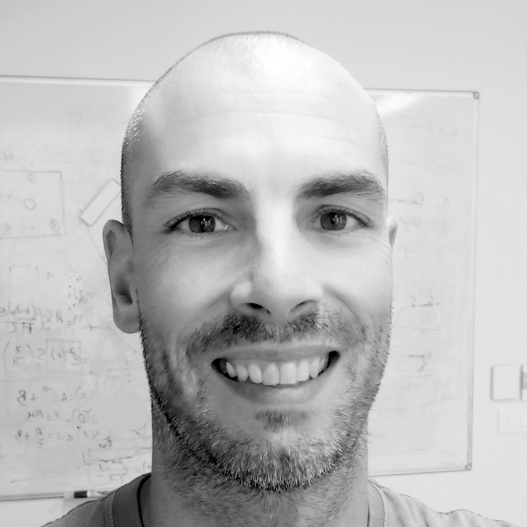
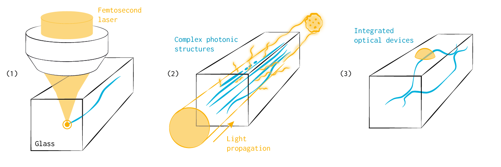

## About Me

Hi! I am Matthieu Bellec a CNRS researcher working at the [Institut de Physique de Nice](https://inphyni.univ-cotedazur.eu). I am part of the [Waves in complex systems](https://inphyni.univ-cotedazur.eu/wacs) group and I am currently leading a small team working on *photonics in complex systems and femtosecond laser structuring*.

## Research interest

My research lies at the intersection of **laser fabrication of novel complex photonic structures in glasses** and **fundamental studies of optical propagation in complex media**.

I develop new types of complex media with tailored, multifunctional photonic properties that can be precisely engineered (1) to address current challenges in optical transport within complex environments, particularly when propagation occurs in *non-trivial regimes*, such as disordered systems, nonlinear responses, or magneto-optical effects (2). Beyond that, the technological advancements arising from this work also create new opportunities for innovation in integrated photonics, particularly in the fields of optical and quantum sensing, as well as astronomical instrumentation (3).

Please read the [Projects](projects) section for more information.

---
## Keywords
#complex media; #direct-laser-writing; #light-matter interaction; # femtosecond laser; #glass science; #integrated photonics; #optical fibers
